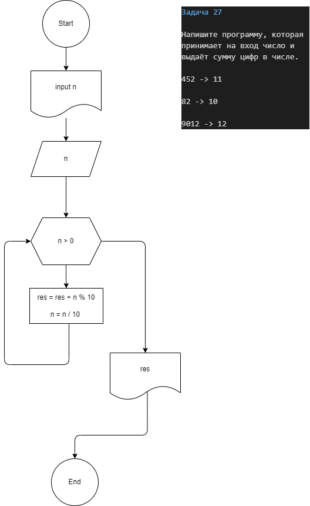

**Contact**
    
    Maksim 

    dvmax1984@mail.ru

## Задача 27

Напишите программу, которая принимает на вход число и выдаёт сумму цифр в числе.

452 -> 11

82 -> 10

9012 -> 12

[КОД](Program.cs)

