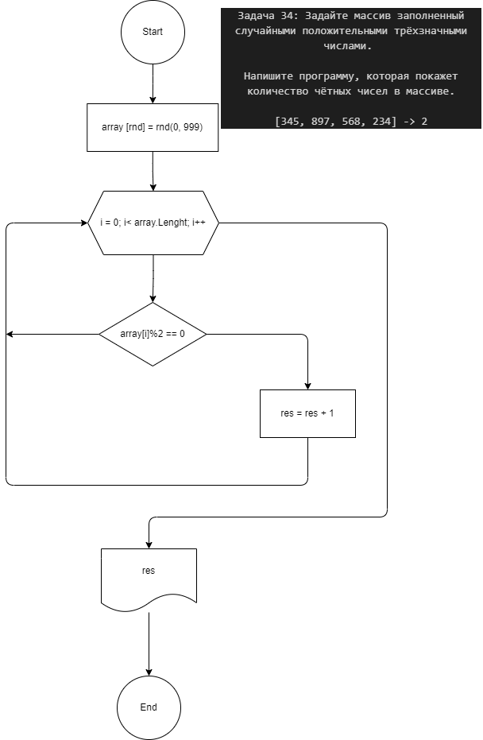

**Contact**
    
    Maksim 

    dvmax1984@mail.ru

## Задача 34: 
Задайте массив заполненный случайными положительными трёхзначными числами. Напишите программу, которая покажет количество чётных чисел в массиве.

[345, 897, 568, 234] -> 2

[КОД](/Csharp25022023/Homework/Homework_05/Ex034/Program.cs)

