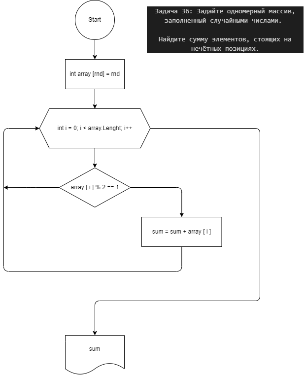

**Contact**
    
    Maksim 

    dvmax1984@mail.ru
    

Задача 36: Задайте одномерный массив, заполненный случайными числами. Найдите сумму элементов, стоящих на нечётных позициях.

[3, 7, 23, 12] -> 19

[-4, -6, 89, 6] -> 0

[КОД](/Csharp25022023/Homework/Homework_05/Ex036/Program.cs)

